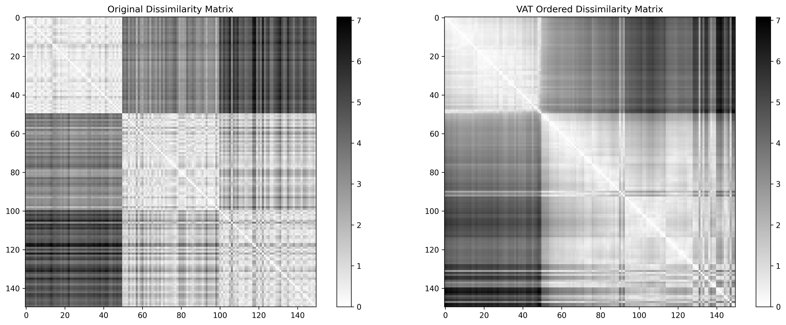
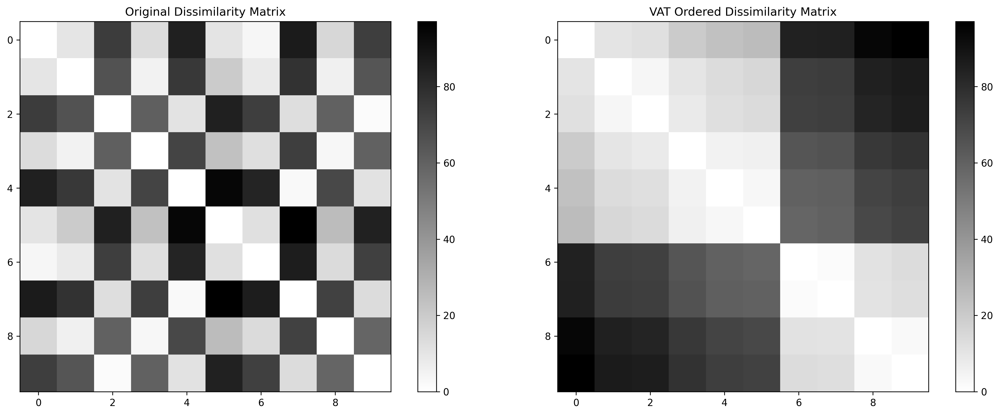

# VAT: Visual Assessment of (Cluster) Tendency

This repository contains my implementation of the VAT algorithm as described in the paper ["VAT: A Tool for Visual Assessment of (Cluster) Tendency"](https://www.researchgate.net/publication/3950332_VAT_A_tool_for_visual_assessment_of_cluster_tendency) by J.C. Bezdek and R.J. Hathaway.

## Algorithm Overview

VAT is a tool for visually assessing whether clusters exist in a dataset before applying clustering algorithms. It has the following approach:

1. **Compute a dissimilarity matrix**: Calculate pairwise distances between all data points.
2. **Reorder the dissimilarity matrix**: Rearrange rows and columns so that similar objects are placed near each other.
3. **Display as an image**: Visualize the reordered matrix where dark blocks along the diagonal indicate potential clusters

## Interpreting VAT Results

- **Dark blocks along the diagonal**: Indicate potential clusters
- **Number of blocks**: Suggests the number of natural clusters
- **Block size**: Indicates the size of clusters
- **Block intensity**: Shows cluster compactness (darker = more compact)

## Examples

### Iris Dataset

Below is an example of VAT applied to the Iris dataset:



*The image shows: (1) Original data colored by actual classes, (2) Data colored by VAT ordering, (3) VAT ordered dissimilarity matrix showing cluster structure*

### Student Performance Dataset

I also applied VAT to a student performance dataset to demonstrate its effectiveness on educational data:



*This analysis reveals natural groupings in student performance across Math, Science, and English subjects. The VAT visualization clearly shows two main clusters corresponding to high-performing and low-performing students.*

The student dataset contains:
- 10 students with their scores in Math, Science, and English
- Natural groupings based on academic performance
- A real-world example of how VAT can be used for educational data analysis

## Installation

```bash
pip install -r requirements.txt